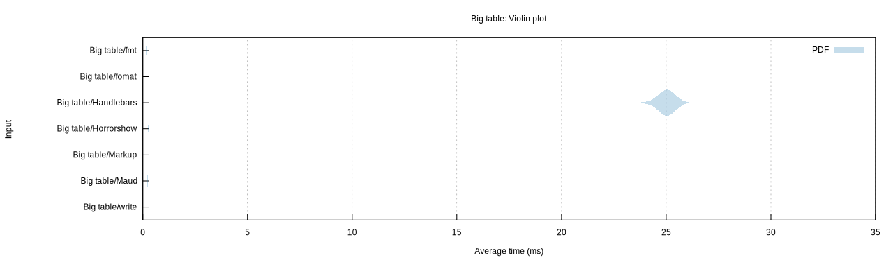

# Rust template engine benchmarks

This repo tries to assess Rust template engine performance. Following the
download ratings from [crates.io][crates], these nine projects are assessed:

- [write!][write]: the std library `write!` macro
- [Handlebars][handlebars]: Handlebars templating implemented in Rust
- [Tera][tera]: template engine based on Jinja2/Django templates
- [Liquid][liquid]: the liquid templating language for Rust
- [Askama][askama]: type-safe, compiled Jinja-like templates for Rust
- [horrorshow][horrorshow]: a templating library written in rust macros
- [ructe][ructe]: Rust Compiled Templates, efficient type-safe web page templates
- [fomat][fomat]: alternative syntax for print/write/format-like macros with a small templating language
- [markup][markup]: A blazing fast, type-safe template engine for Rust.
- [maud][maud]: A Compile-time HTML template engine for Rust.
- [sailfish][sailfish]: Simple, small, and extremely fast template engine for Rust 

[crates]: https://crates.io/categories/template-engine
[write]: https://doc.rust-lang.org/std/macro.write.html
[handlebars]: https://github.com/sunng87/handlebars-rust
[tera]: https://github.com/Keats/tera
[liquid]: https://github.com/cobalt-org/liquid-rust
[askama]: https://github.com/djc/askama
[ructe]: https://github.com/kaj/ructe
[horrorshow]: https://github.com/Stebalien/horrorshow-rs
[fomat]: https://github.com/krdln/fomat-macros
[markup]: https://github.com/utkarshkukreti/markup.rs
[sailfish]: https://github.com/Kogia-sima/sailfish
[maud]: https://github.com/lambda-fairy/maud

## Results

These results are from 2023-3-11 (rustc 1.68.0), running on an MacBook Pro 16 (2021) M1 Pro CPU. Your mileage may vary.

As a [violin plot] generated by [Criterion]:




[violin plot]: https://en.wikipedia.org/wiki/Violin_plot
[Criterion]: https://japaric.github.io/criterion.rs/

Numbers, as output by Criterion:

```
Big table/Askama        time:   [330.10 µs 330.50 µs 330.95 µs]
Big table/fomat         time:   [226.79 µs 227.74 µs 228.66 µs]
Big table/Handlebars    time:   [3.6592 ms 3.6656 ms 3.6717 ms]
Big table/Horrorshow    time:   [166.35 µs 167.28 µs 168.16 µs]
Big table/Liquid        time:   [4.3793 ms 4.3828 ms 4.3864 ms]
Big table/Markup        time:   [54.963 µs 55.928 µs 56.784 µs]
Big table/Maud          time:   [71.931 µs 72.305 µs 72.697 µs]
Big table/Ructe         time:   [205.25 µs 205.70 µs 206.13 µs]
Big table/Sailfish      time:   [17.695 µs 17.711 µs 17.729 µs]
Big table/Tera          time:   [856.34 µs 857.40 µs 858.65 µs]
Big table/write         time:   [249.80 µs 250.29 µs 250.76 µs]

Teams/Askama            time:   [527.14 ns 527.87 ns 528.64 ns]
Teams/fomat             time:   [345.85 ns 346.65 ns 347.67 ns]
Teams/Handlebars        time:   [3.4753 µs 3.4808 µs 3.4860 µs]
Teams/Horrorshow        time:   [304.40 ns 305.30 ns 306.29 ns]
Teams/Liquid            time:   [4.3580 µs 4.3630 µs 4.3678 µs]
Teams/Markup            time:   [133.69 ns 134.39 ns 135.14 ns]
Teams/Maud              time:   [124.09 ns 124.53 ns 125.07 ns]
Teams/Ructe             time:   [461.57 ns 462.53 ns 463.52 ns]
Teams/Sailfish          time:   [89.921 ns 90.015 ns 90.100 ns]
Teams/Tera              time:   [3.0020 µs 3.0062 µs 3.0105 µs]
Teams/write             time:   [478.97 ns 480.01 ns 481.01 ns]
```

## Running the benchmarks

```bash
$ cargo bench
```

Plots will be rendered if `gnuplot` is installed and will be available in the
`target/criterion` folder.
