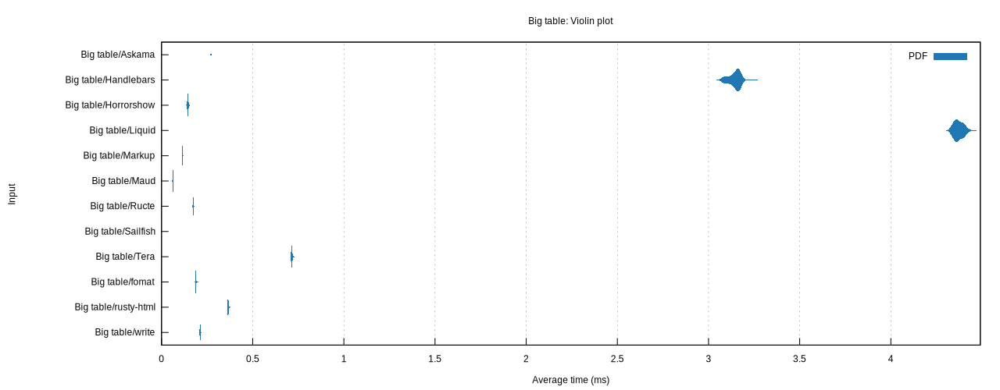
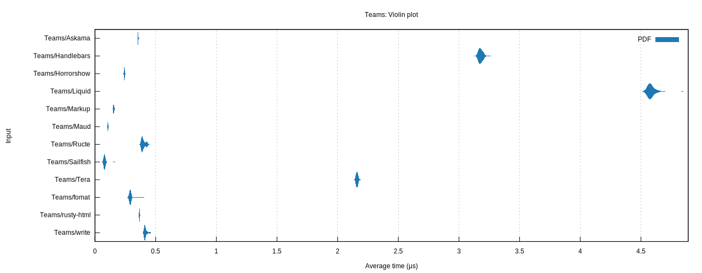

# Rust template engine benchmarks

This repo tries to assess Rust template engine performance. Following the
download ratings from [crates.io][crates], these nine projects are assessed:

-   [write!][write]: the std library `write!` macro
-   [Handlebars][handlebars]: Handlebars templating implemented in Rust
-   [Tera][tera]: template engine based on Jinja2/Django templates
-   [Liquid][liquid]: the liquid templating language for Rust
-   [Askama][askama]: type-safe, compiled Jinja-like templates for Rust
-   [horrorshow][horrorshow]: a templating library written in rust macros
-   [ructe][ructe]: Rust Compiled Templates, efficient type-safe web page templates
-   [fomat][fomat]: alternative syntax for print/write/format-like macros with a small templating language
-   [markup][markup]: A blazing fast, type-safe template engine for Rust.
-   [maud][maud]: A Compile-time HTML template engine for Rust.
-   [sailfish][sailfish]: Simple, small, and extremely fast template engine for Rust
-   [rusty-html][rusty-html]: Rusty HTML is a html-templating framework

[crates]: https://crates.io/categories/template-engine
[write]: https://doc.rust-lang.org/std/macro.write.html
[handlebars]: https://github.com/sunng87/handlebars-rust
[tera]: https://github.com/Keats/tera
[liquid]: https://github.com/cobalt-org/liquid-rust
[askama]: https://github.com/djc/askama
[ructe]: https://github.com/kaj/ructe
[horrorshow]: https://github.com/Stebalien/horrorshow-rs
[fomat]: https://github.com/krdln/fomat-macros
[markup]: https://github.com/utkarshkukreti/markup.rs
[sailfish]: https://github.com/Kogia-sima/sailfish
[maud]: https://github.com/lambda-fairy/maud
[rusty-html]: https://github.com/michaelvanstraten/rusty-html

## Results

These results are from 2023-4-25 (rustc 1.70.0), running on an MacBook Pro 16 (2021) M1 Max CPU. Your mileage may vary.

As a [violin plot] generated by [Criterion]:




[violin plot]: https://en.wikipedia.org/wiki/Violin_plot
[Criterion]: https://japaric.github.io/criterion.rs/

Numbers, as output by Criterion:

```
Big table/Askama        time:   [270.72 µs 270.85 µs 270.99 µs]
Big table/fomat         time:   [187.50 µs 187.87 µs 188.26 µs]
Big table/Handlebars    time:   [3.1371 ms 3.1435 ms 3.1497 ms]
Big table/Horrorshow    time:   [143.90 µs 144.46 µs 145.00 µs]
Big table/Liquid        time:   [4.3673 ms 4.3724 ms 4.3776 ms]
Big table/Markup        time:   [114.28 µs 114.55 µs 114.79 µs]
Big table/Maud          time:   [62.309 µs 62.775 µs 63.403 µs]
Big table/Ructe         time:   [173.42 µs 173.78 µs 174.13 µs]
Big table/Sailfish      time:   [16.677 µs 16.694 µs 16.713 µs]
Big table/Tera          time:   [713.96 µs 714.37 µs 714.81 µs]
Big table/write         time:   [211.24 µs 211.47 µs 211.72 µs]
Big table/rusty-html    time:   [364.98 µs 365.31 µs 365.64 µs]

Teams/Askama            time:   [354.37 ns 354.84 ns 355.32 ns]
Teams/fomat             time:   [290.25 ns 290.59 ns 290.93 ns]
Teams/Handlebars        time:   [3.1749 µs 3.1787 µs 3.1825 µs]
Teams/Horrorshow        time:   [242.59 ns 243.08 ns 243.61 ns]
Teams/Liquid            time:   [4.5712 µs 4.5752 µs 4.5795 µs]
Teams/Markup            time:   [152.88 ns 153.44 ns 154.03 ns]
Teams/Maud              time:   [104.42 ns 105.00 ns 105.62 ns]
Teams/Ructe             time:   [394.30 ns 397.86 ns 401.71 ns]
Teams/Sailfish          time:   [77.824 ns 78.297 ns 78.841 ns]
Teams/Tera              time:   [2.1584 µs 2.1604 µs 2.1623 µs]
Teams/write             time:   [411.73 ns 413.63 ns 415.92 ns]
Teams/rusty-html        time:   [365.90 ns 366.35 ns 366.80 ns]
```

## Running the benchmarks

```bash
$ cargo bench
```

Plots will be rendered if `gnuplot` is installed and will be available in the
`target/criterion` folder.
